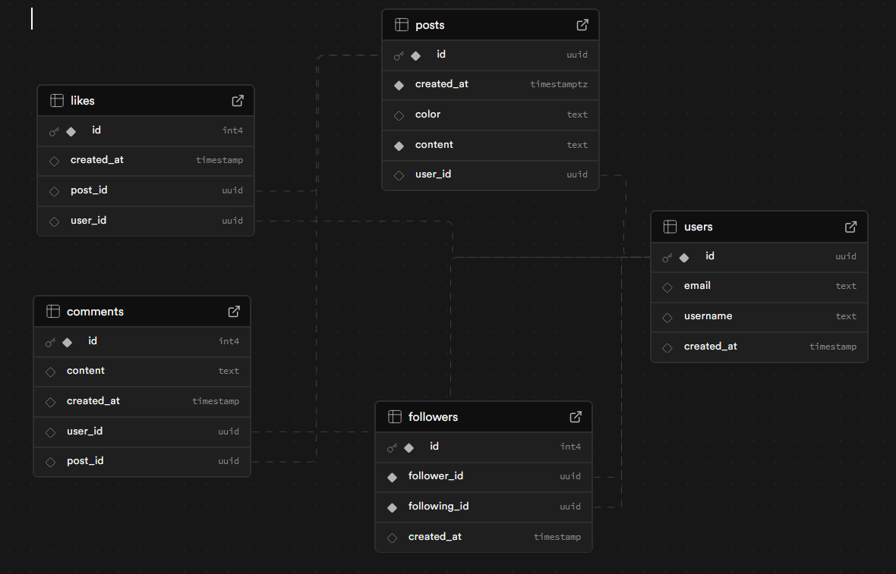

# Moment-Share

Moment-Share is a web application for sharing textual moments, thoughts or quotes. It allows users to quickly and easily share their moments with friends and the community. The web application was built using React and Supabase was used for authentication and the database.

The main idea behind Moment-Share is to create a space for real conversations. Instead of focusing on likes and popularity, this app is all about connecting with the people you follow and having meaningful exchanges through comments. It’s designed to let you interact with close friends and community members, making it less about numbers and more about the quality of the conversations.

## Application Demo
https://github.com/user-attachments/assets/0dac32c9-cb15-4b92-921f-4447d414bc73

## Features

- **Create and Share Textual Moments**: Users can share their thoughts, quotes, statuses, or any text-based content.
- **User Can Add or Remove Followers**: Users can see all their followers and also add or remove people who follow or whom they follow.
- **Real-Time Updates**: View shared moments from other users.
- **User Profiles**: Each user has a profile to personalize their experience.
- **See and Manage Own Moments**: Users can see all their moments and delete them.
- **Authentication**: Features such as login, registration, and logout for user accounts.
- **Live Comments**: Implemented comment functionality to enable interaction between users on shared moments. Users can post, view, and manage comments in real time, creating a dynamic and engaging social experience.

## Database Schema

